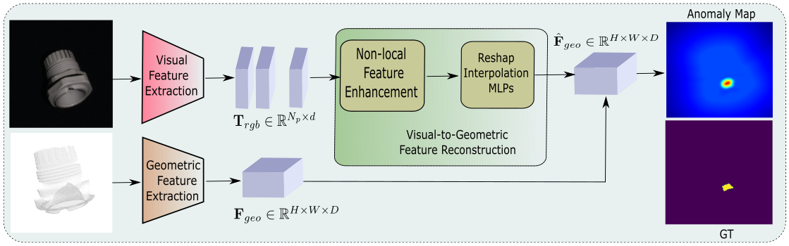
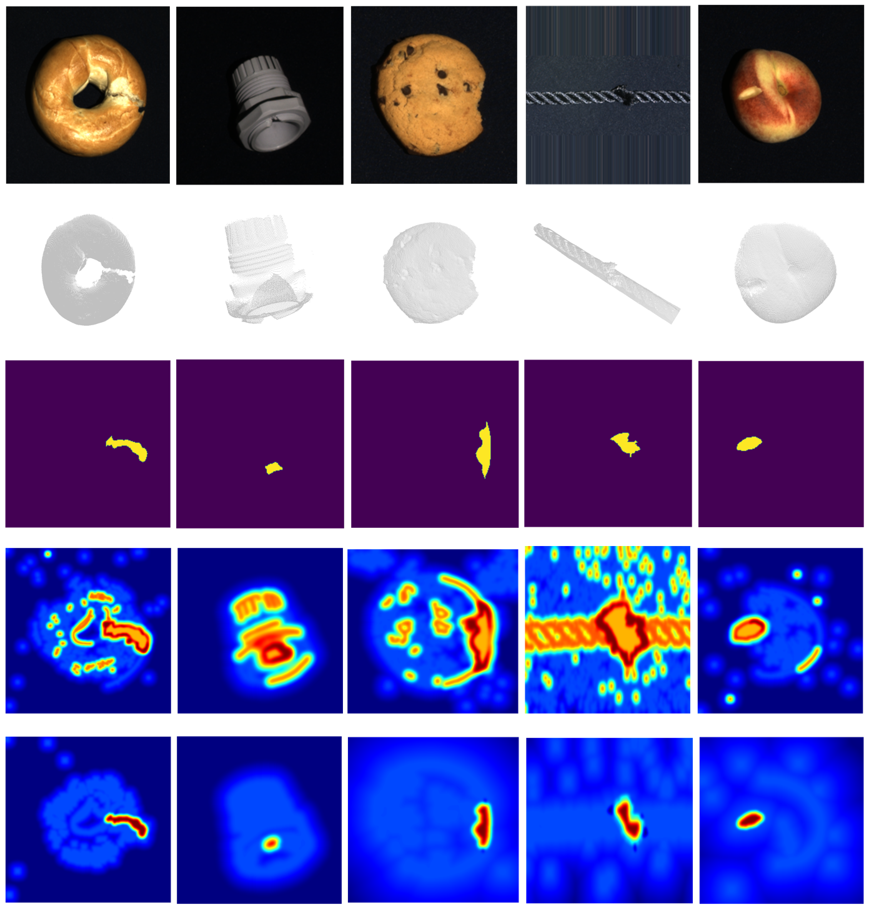

# Unsupervised geometric-guided industrial anomaly detection

## Paper
Our paper is now publicly available. For more details, please visit: [IEEE Xplore](https://ieeexplore.ieee.org/document/10820339).

## Install
You should install all the necessary dependencies in the `./requirements.txt` file.

## Datasets
Download [MVtec 3D-AD](https://www.mvtec.com/company/research/datasets/mvtec-3d-ad), then preprocess it with the script `preprocess_mvtec.py`.

Download [Synthetic Dataset (Simulation)](https://github.com/synthetic-dataset/simulation).

## Training
To train the network refer to the example in `train.sh`.

The `training.py` script trains the network.

You can specify the following options:

- `--dataset_path`: Path to the root directory of the dataset.
- `--checkpoint_savepath`: Path to the directory on which checkpoints will be saved, i.e., `checkpoints/checkpoints_mvtec`.
- `--class_name`: Class on which the FADs are trained.
- `--epochs_no`: Number of epochs for FADs optimization.
- `--batch_size`: Number of samples per batch for FADs optimization.

## Inference
The `inference.py` script tests the trained model. It can be used to generate anomaly maps.

You can specify the following options:

- `--dataset_path`: Path to the root directory of the dataset.
- `--checkpoint_folder`: Path to the directory of the checkpoints, i.e., `checkpoints/checkpoints_mvtec`.
- `--class_name`: Class on which the FADs was trained.
- `--epochs_no`: Number of epochs used in FADs optimization.
- `--batch_size`: Number of samples per batch employed for FADs optimization.
- `--qualitative_folder`: Folder on which the anomaly maps are saved.
- `--quantitative_folder`: Folder on which the metrics are saved.
- `--visualize_plot`: Flag to visualize qualitative during inference.
- `--produce_qualitatives`: Flag to save qualitative during inference.

## Result

## Note
- The code utilizes `wandb` during training to log results. Please be sure to have a wandb account. Otherwise, if you prefer to not use `wandb`, disable it in `training.py` with the `flag mode = disabled`.
